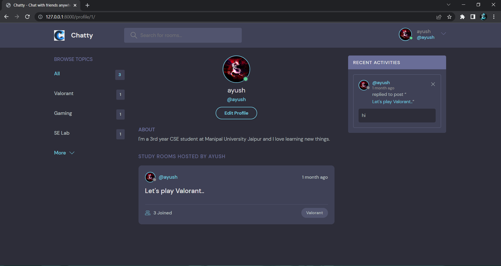

<div>
# Chatty

A Social Media type webapp for chatting purpose

</div>

--> Create a virtual environment first :

```bash

pip install virtualenv
virtualenv {environment name}

```

--> Activate the virtual environment :

```bash
envname\scripts\activate

```

--> Install the requirements :

```bash
pip install -r requirements.txt

```

### Running the App

--> To run the App, we use :

```bash
python manage.py runserver

```

> ⚠ Then, the development server will be started at http://127.0.0.1:8000/

#

### ScreenShots




#
