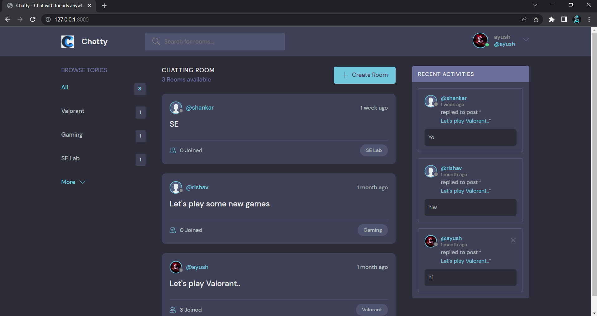
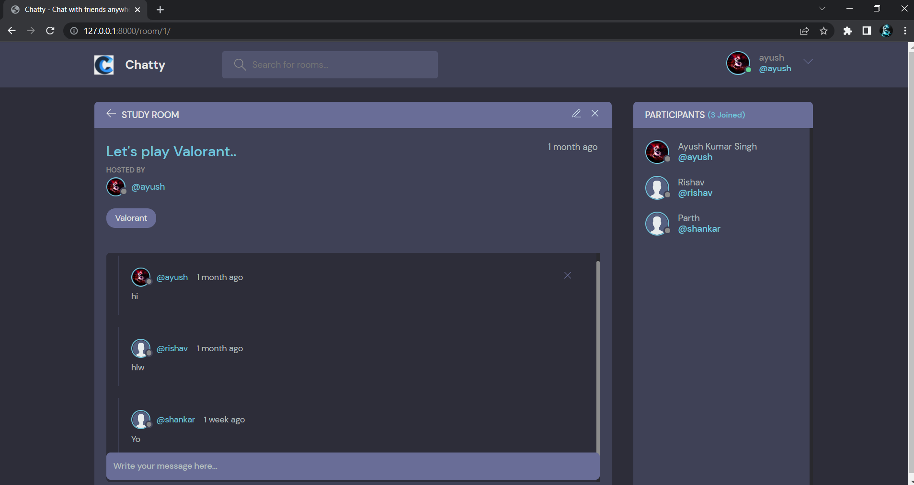

<div>
# Chatty

A Social Media type webapp for chatting purpose

</div>

--> Create a virtual environment first :

```bash

pip install virtualenv
virtualenv {environment name}

```

--> Activate the virtual environment :

```bash
envname\scripts\activate.bat

```

--> Install the requirements :

```bash
pip install -r requirements.txt

```

### Running the App

--> To run the App, we use :

```bash
python manage.py runserver

```

> ⚠ Then, the development server will be started at http://127.0.0.1:8000/

#

### WebApp Preview :

<div>
<p align="center">
    Home Page Preview
</p>



</div>

<table width="100%"> 
<tr>
<td width="50%">      
&nbsp; 
<br>
<p align="center">
    Profile Preview
</p>

</td> 
<td width="50%">
<br>
<p align="center">
  Room Conversation Preview
</p>
  
</td>
</table>
